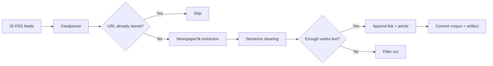

<div align="center">

<sub>Real photography by <a href="https://commons.wikimedia.org/wiki/File:Person_reading_a_newspaper_(Unsplash).jpg">Roman Kraft on Wikimedia Commons (CC0)</a>.</sub>

# CEUIL News Scraper
### A scheduled ingestion pipeline for building a deduplicated, information-dense news corpus.

[](https://github.com/TanishC4444/CEUILnewsScraper/actions/workflows/news_scraper.yml)


[Architecture](#architecture) · [Filtering](#content-filtering) · [Automation](#automation) · [Engineering](#engineering-notes)
</div>

---

## Overview

CEUIL News Scraper collects recent stories from 25 configured RSS feeds, extracts full article text with Newspaper3k, filters low-information sentences, and appends unseen articles to a persistent corpus. Its GitHub Actions workflow schedules collection, commits corpus changes, and preserves each run as a short-lived artifact.

## Architecture



## Content filtering

The cleaner favors sentences that are useful for downstream question generation:

- splits text with a compiled sentence-boundary expression;
- discards short sentences;
- removes exact sentence repetitions;
- requires at least 30 words;
- keeps sentences containing a number or a capitalized proper-noun candidate;
- normalizes whitespace;
- accepts an article only when the cleaned result exceeds 30 words.

An `lru_cache` backs the reusable number/proper-noun helper, while a set of stored `Link:` lines prevents duplicates across runs.

## Run locally

```bash
git clone https://github.com/TanishC4444/CEUILnewsScraper.git
cd CEUILnewsScraper
python -m venv .venv
source .venv/bin/activate
python -m pip install feedparser newspaper3k "lxml[html_clean]" lxml_html_clean
python news_scraper.py
```

Output is appended to `articles/news_articles.txt` as alternating link and article records.

## Automation

The workflow is configured for manual dispatch, changes to `news_scraper.py`, and the cron expression `*/1 * * * *`. Although an inline comment says five minutes, the actual expression requests a run every minute; GitHub Actions may delay high-frequency schedules.

The job installs extraction dependencies, runs with a 20-minute script timeout, commits `articles/` when changed, and uploads the directory for seven days.

## Repository map

```text
CEUILnewsScraper/
├── .github/workflows/
│   ├── news_scraper.yml
│   └── requirements.txt
├── articles/news_articles.txt   persistent generated corpus
├── news_scraper.py              production collector
└── test.py                      five-article extraction experiment
```

## Engineering notes

- **Source breadth:** feeds span general, international, political, business, technology, health, and regional coverage.
- **Durable deduplication:** the corpus itself is the URL index.
- **Responsible pacing:** individual article attempts pause briefly.
- **Tradeoff:** an append-only 100+ MB tracked text file makes cloning, diffs, and git history expensive.
- **Reliability boundary:** feed and article errors are isolated, but there are no retries/backoff and feed parsing has no explicit timeout.
- **Heuristic boundary:** capitalization is only a rough proxy for information density.

## Skills demonstrated

RSS ingestion · web extraction · text normalization · heuristic NLP · cache usage · persistent deduplication · scheduled CI · artifact and state management

## Resume-ready highlight

> Engineered a scheduled 25-source news ingestion pipeline with article extraction, information-density filtering, cross-run URL deduplication, Git-backed persistence, and CI artifacts.

## Responsible use

Respect publisher terms, robots policies, copyright, and reasonable request rates. Treat the corpus as working input rather than a redistribution product.

## License

No license file is currently included.

